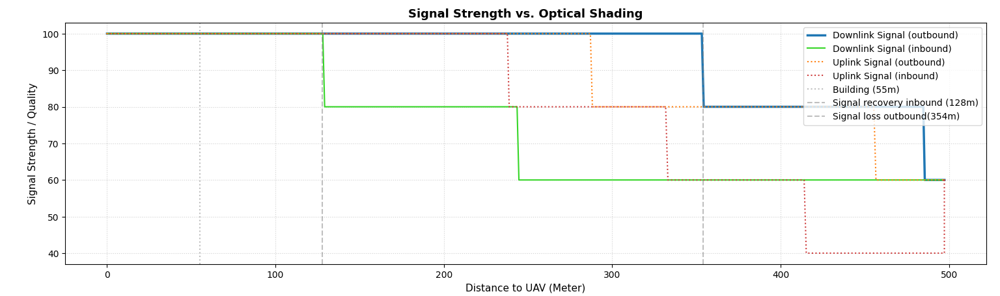
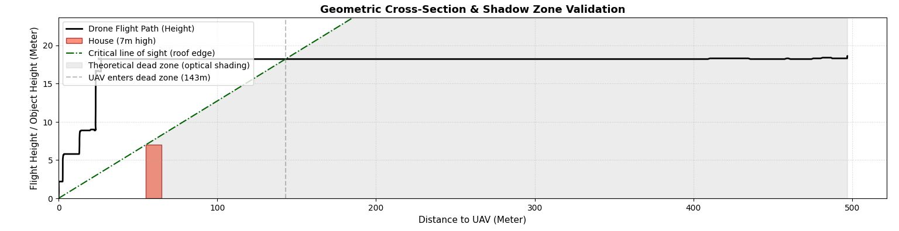
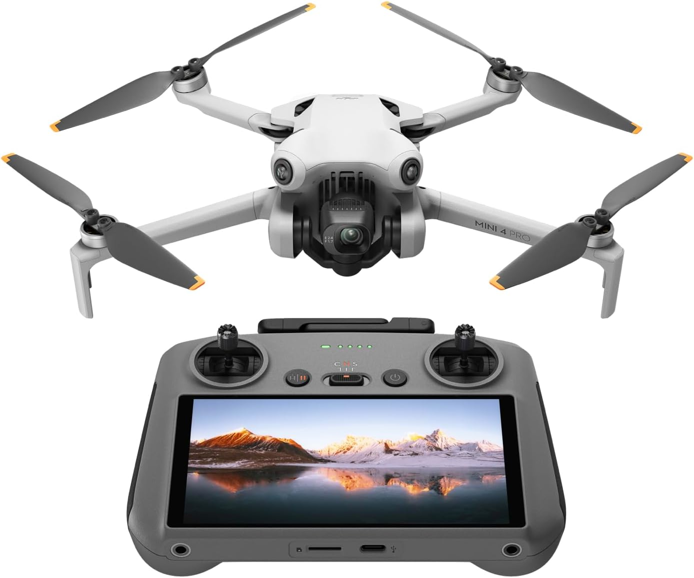
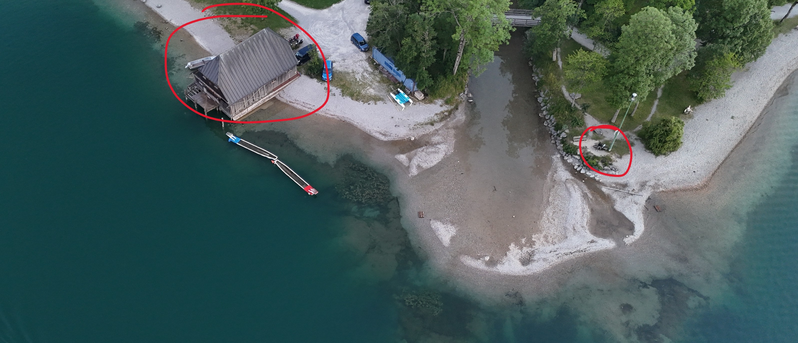
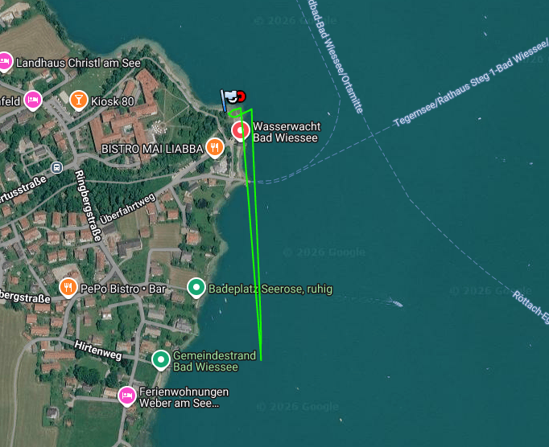

# Case Study: 3D RF Datalink Mapping & Obstacle Validation

An empirical analysis of a 2.4/5.8 GHz FHSS drone telemetry link (DJI OcuSync) under Non-Line-of-Sight (NLOS) conditions. This project demonstrates end-to-end data pipeline engineering: from raw flight-log extraction and geospatial processing to geometric sensor fusion and hardware limitation diagnostics.

---

## 1. Executive Summary & Objective
The goal of this experiment was to map the signal degradation of an autonomous UAV data link during a linear Beyond-Visual-Line-of-Sight (BVLOS) flight profile and correlate sudden drops in Signal Quality (RSSI/SNR equivalent) with a known physical obstacle (a building, height $\approx 7\,\text{m}$ at a baseline distance of $55\,\text{m}$).

**Key Finding:** Signal degradation did not occur at the obstacle’s ground coordinates ($ x = 55\,\text{m} $), but precisely at a 3D line-of-sight (LOS) intersection point further downrange, validating edge-diffraction and Fresnel zone clearance boundaries.

---

## 2. Methodology & Data Pipeline
A standard consumer UAV (DJI Mini 4 Pro) was utilized as a mobile RF probe. Telemetry packets were extracted from flight controller storage via a custom Python data pipeline.

---

### Mathematical Formulations:

* **Horizontal Distance ($d_{2D}$):** Computed via the *Haversine Formula* to account for earth curvature over geospatial coordinate vectors:
$$ a = \sin^2\left(\frac{\Delta\phi}{2}\right) + \cos(\phi_1)\cos(\phi_2)\sin^2\left(\frac{\Delta\lambda}{2}\right) $$
$$ c = 2\cdot\operatorname{atan2}(\sqrt{a}, \sqrt{1-a}), \quad d_{2D} = R\cdot c $$

* **True Slant Range ($d_{3D}$):** Derived via the Pythagorean theorem using normalized altitude $h$:
$$ d_{3D} = \sqrt{d_{2D}^2 + h^2} $$

* **Critical Geometric LOS Threshold ($y_{crit}$):** Defined by the line intercept over the building's peak ($x_{obstacle} = 55\,\text{m}, y_{obstacle} = 7\,\text{m}$):
$$ y_{crit}(x) = \frac{7}{55} \cdot x_{2D} \approx 0.127 \cdot x_{2D} $$

---

## 3. Data Visualization & Empirical Results

Here is how the system's downlink performance correlates with the geometric profile of the flight path.

### RF Link Quality vs. Distance
The upper plot isolates the signal hysteresis. The distinct variance between out-bound and in-bound links exposes the directional characteristics and polarization of the embedded drone antennas.

*Figure 1: Downlink signal decay plotted against 3D slant range.*

### Geometric Cross-Section & Shadow Zone Validation
The lower plot models the side profile. The physical intercept point perfectly aligns with the link termination zone.

*Figure 2: 2D side view showing the UAV trajectory dropping below the critical roof-line LOS into the RF shadow zone.*

---

## 4. Engineering Insights & RF Phenomena

1. **Hysteresis Analysis:** The out-bound link maintained lock significantly longer than the in-bound link re-acquisition threshold. This points to transmitter-side power amplification and receiver-side LNA (Low Noise Amplifier) sensitivity delays during re-locking.
2. **Knife-Edge Diffraction:** The signal did not flatline instantly upon breaking the optical line of sight. Due to *diffraction* at the roof edge, RF energy bent into the shadow zone, allowing degraded telemetry to persist until the Fresnel zone was blocked past the critical threshold. Furthermore, frequency hopping plays a role in a prolonged signal stability.
3. **Handshake:** Signal recovery takes longer because of synchronisation handshake. Upon entering line of sight, full signal strength is available.

---

## 5. Technical Stack
*   **Language:** Python 3.11
*   **Data Science:** Pandas, NumPy (Vectorized array operations for low latency processing)
*   **Visualization:** Matplotlib (Subplots, Patches API for geometric rendering)
*   **Deployment:** GitHub Pages / Markdown documentation

---

## 6. Visual Impressions & Experimental Setups

Below are the hardware probe and field deployment environments utilized for this study:

| UAV Hardware Probe Configuration | Field Testing Site & Obstacle Geometry |
| :---: | :---: |
|  |  |
| *Figure 3: DJI Mini 4 Pro transceiver platform.* | *Figure 4: Visual perspective of the 7m obstructing structure.* |
|  | 
| *Figure 5: Satellite view of the flight path.* |